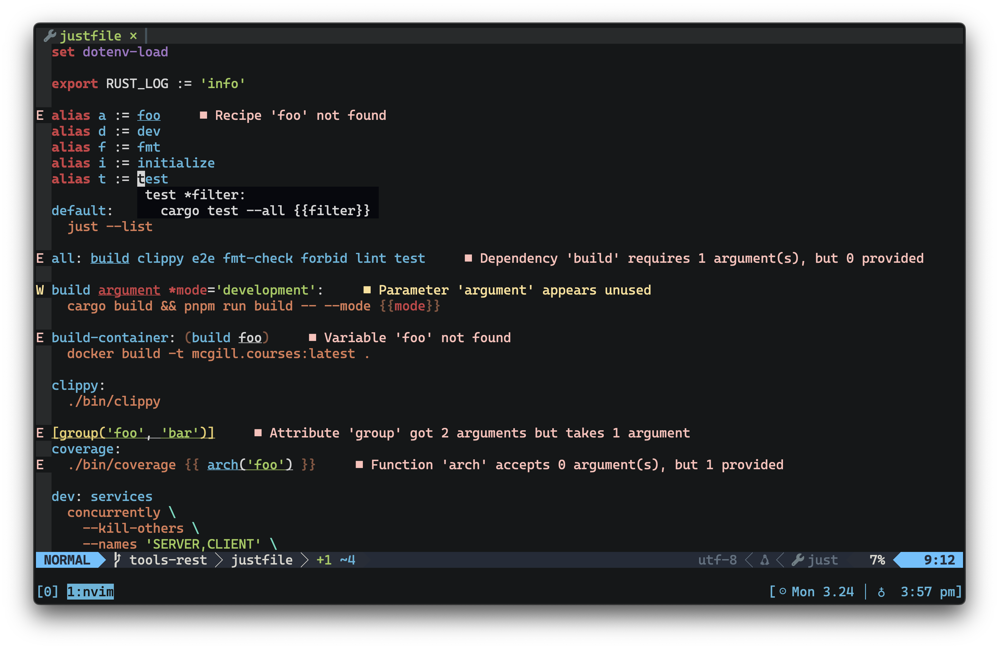

## just-lsp

[](https://github.com/terror/just-lsp/releases/latest)
[](https://crates.io/crates/just-lsp)
[](https://github.com/terror/just-lsp/actions/workflows/ci.yaml)
[](https://codecov.io/gh/terror/just-lsp)
[](https://github.com/terror/just-lsp/releases)
[](https://deps.rs/repo/github/terror/just-lsp)

`just-lsp` is a server implementation of the
[language server protocol](https://microsoft.github.io/language-server-protocol/)
for [just](https://github.com/casey/just), the command runner.



`just-lsp` brings rich editor support to your justfiles, including:

- Completions for recipe names, variables, and all builtins: attributes,
  constants, functions, and settings.

- Hover docs for whatever's under your cursor: recipe definitions, parameter
  declarations, variable assignments, and the full builtin reference.

- Jump to definition for recipes, aliases, parameters, assignments, and builtin
  constants.

- Diagnostics on every change, catching syntax errors, unknown recipes, bad
  dependencies, indentation issues, and more. See
  [`docs/diagnostics.md`](docs/diagnostics.md) for the full list of rules.

- Rename and find references for recipes, aliases, variables, and parameters,
  scope-aware so refactors don't accidentally rewrite unrelated identifiers.

- Run any recipe directly from your editor via a code action, with optional
  argument prompting before `just` is invoked.

- Semantic highlighting, folding, and formatting via `just --fmt --unstable`.

If you need help with `just-lsp` please feel free to open an issue or ping me on
[Discord](https://discord.gg/ezYScXR). Feature requests and bug reports are
always welcome!

## Installation

`just-lsp` should run on any system, including Linux, MacOS, and the BSDs.

The easiest way to install it is by using
[cargo](https://doc.rust-lang.org/cargo/index.html), the Rust package manager:

```bash
cargo install just-lsp
```

Otherwise, see below for the complete package list:

#### Cross-platform

<table>
  <thead>
    <tr>
      <th>Package Manager</th>
      <th>Package</th>
      <th>Command</th>
    </tr>
  </thead>
  <tbody>
    <tr>
      <td><a href=https://www.rust-lang.org>Cargo</a></td>
      <td><a href=https://crates.io/crates/just-lsp>just-lsp</a></td>
      <td><code>cargo install just-lsp</code></td>
    </tr>
    <tr>
      <td><a href=https://brew.sh>Homebrew</a></td>
      <td><a href=https://github.com/terror/homebrew-tap>terror/tap/just-lsp</a></td>
      <td><code>brew install terror/tap/just-lsp</code></td>
    </tr>
  </tbody>
</table>

#### Linux

<table>
  <thead>
    <tr>
      <th>Operating System</th>
      <th>Package Manager</th>
      <th>Package</th>
      <th>Command</th>
    </tr>
  </thead>
  <tbody>
    <tr>
      <td><a href=https://www.archlinux.org>Arch</a></td>
      <td><a href=https://wiki.archlinux.org/title/Pacman>pacman</a></td>
      <td><a href=https://archlinux.org/packages/extra/x86_64/just-lsp/>just-lsp</a></td>
      <td><code>pacman -S just-lsp</code></td>
    </tr>
  </tbody>
</table>


### Mason

You can also install the server via
[mason](https://github.com/williamboman/mason.nvim), the Neovim plugin that
allows you to easily manage external editor tooling such as LSP servers, DAP
servers, etc.

Simply invoke `:Mason` in your editor, and find `just-lsp` in the dropdown to
install it.

### Pre-built binaries

Pre-built binaries for Linux, MacOS, and Windows can be found on
[the releases page](https://github.com/terror/just-lsp/releases).

## Usage

### CLI

Running `just-lsp` with no arguments starts the language server over
stdin/stdout.

#### `analyze`

The `analyze` subcommand runs the diagnostic engine on a justfile and prints any
warnings or errors to stderr, without starting the language server:

```bash
just-lsp analyze [PATH]
```

When `PATH` is omitted it searches the current directory and its ancestors for a
file named `justfile`. The exit code is non-zero if any error-severity
diagnostic is found.

### Editor Integration

`just-lsp` can be used with any LSP client, this section documents integration
with some of the more popular ones.

### Neovim

`nvim-lspconfig` exposes its server definitions to the builtin
[`vim.lsp.config`](https://neovim.io/doc/user/lsp.html#lsp-config) API, so the
old `require('lspconfig').just.setup()` pattern is deprecated. With Nvim 0.11.3+
and the latest nvim-lspconfig installed, enabling `just-lsp` looks like:

```lua
vim.lsp.enable('just')
```

If you need to override the default command, capabilities, or hooks, define (or
extend) the config before enabling it:

```lua
vim.lsp.config('just', {
  cmd = { '/path/to/just-lsp' }, -- only needed when the binary is not on $PATH
  on_attach = function(client, bufnr)
    -- add your mappings or buffer-local options
  end,
  capabilities = require('cmp_nvim_lsp').default_capabilities(),
})

vim.lsp.enable('just')
```

`vim.lsp.config` automatically merges your overrides with the upstream config
shipped inside nvim-lspconfig's `lsp/just.lua`.

`capabilities` describe what features your client supports (completion snippets,
folding ranges, etc.). The helper from `cmp-nvim-lsp` augments the defaults so
completion-related capabilities line up with `nvim-cmp`. If you do not use
`nvim-cmp`, you can omit the field or build your own table.

### Visual Studio Code

A third-party [**Visual Studio Code**](https://code.visualstudio.com/) extension
is maintained over at https://github.com/nefrob/vscode-just, written by
[@nefrob](https://github.com/nefrob). Follow the instructions in that repository
to get it setup on your system.

### Zed

A third-party [**Zed**](https://zed.dev/) extension is maintained over at
https://github.com/jackTabsCode/zed-just, written by
[@jackTabsCode](https://github.com/jackTabsCode) &
[@mattrobenolt](https://github.com/mattrobenolt). Follow the instructions in
that repository to get it setup on your system.


If you want to develop on zed against your local `just-lsp`, add something like this to
your `settings.json`.
```settings.json
 "lsp": {
    "just-lsp": {
      "binary": {
        "path": "~/just-lsp/target/debug/just-lsp",
      },
    },
  },
  "languages": {
    "Just": {
      "language_servers": ["just-lsp"],
    },
  },
```


Add a new key binding to restart lsp to `keymap.json`


```
    "context": "Editor",
    "bindings": {
      "ctrl-r l": "editor::RestartLanguageServer"
    }
```


or use `editor: restart language server` in the command palette.

## Configuration

`just-lsp` accepts configuration through the LSP `initializationOptions` object,
sent from your editor when the server starts.

### Rules

Individual diagnostic rules can be configured under the `rules` key. Each rule
is keyed by its code (see [`docs/diagnostics.md`](docs/diagnostics.md)) and
accepts either a level string or a table with a `level` field:

```json
{
  "rules": {
    "unused-variables": "off",
    "unused-parameters": { "level": "error" }
  }
}
```

Supported levels are `error`, `warning`, `information` (or `info`), `hint`, and
`off`. Setting a rule to `off` suppresses it entirely; any other level overrides
the rule's default severity. Rules that are not listed retain their default
behavior.

#### Neovim

Pass the configuration table via the `init_options` field:

```lua
vim.lsp.config('just', {
  init_options = {
    rules = {
      ['unused-variables'] = 'off',
      ['unused-parameters'] = { level = 'warning' },
    },
  },
})

vim.lsp.enable('just')
```

## Development

I use [Neovim](https://neovim.io/) to work on this project, and I load the
development build of this server to test out my changes instantly. This section
describes a development setup using Neovim as the LSP client, for other clients
you would need to look up their respective documentation.

First, clone the repository and build the project:

```
git clone https://github.com/terror/just-lsp
cd just-lsp
cargo build
```

Add this to your editor configuration:

```lua
local dev_cmd = '/path/to/just-lsp/target/debug/just-lsp'

local on_attach = function(client, bufnr)
  -- Add your implementation here
end

local capabilities = require('cmp_nvim_lsp').default_capabilities()

vim.lsp.config('just_dev', {
  cmd = { dev_cmd },
  filetypes = { 'just' },
  root_dir = function(fname)
    return vim.fs.root(fname, { '.git', 'justfile' })
  end,
  on_attach = on_attach,
  capabilities = capabilities,
})

vim.lsp.enable('just_dev')
```

This uses a separate config name (`just_dev`) so you can switch between the
local development build and the stock `just` config. Replace `dev_cmd` with the
absolute path to your freshly built binary.

`on_attach` is a function that gets called after an LSP client attaches to a
buffer,
[mine](https://github.com/terror/dotfiles/blob/0cc595de761d27d99367ad0ea98920b7718be4fb/etc/nvim/lua/config.lua#L207)
just sets up a few mappings:

```lua
local on_attach = function(client, bufnr)
  -- ...
  map('n', '<leader>ar', '<cmd>lua vim.lsp.buf.rename()<CR>')
  map('n', '<leader>s', '<cmd>lua vim.lsp.buf.format({ async = true })<CR>')
  -- ...
end
```

As in the basic example above, we use `cmp_nvim_lsp.default_capabilities()` so
that the dev build inherits completion-related capabilities from `nvim-cmp`.
Swap in your own table if you use a different completion plugin.

**n.b.** This setup requires the
[nvim-lspconfig](https://github.com/neovim/nvim-lspconfig) plugin (and
optionally [cmp-nvim-lsp](https://github.com/hrsh7th/cmp-nvim-lsp) for the
capabilities helper).

### Extending the parser

`just-lsp` vendors the
[`tree-sitter-just`](https://github.com/terror/just-lsp/tree/master/vendor/tree-sitter-just)
parser in `vendor/tree-sitter-just`. After changing the grammar or query files,
rebuild and test the parser with the following commands:

```bash
`cd vendor/tree-sitter-just && npx tree-sitter generate`
`cd vendor/tree-sitter-just && npx tree-sitter test`
`cargo test`
```

**n.b.** `just update-parser` will run all of the above for you.

The generate step updates the parser artifacts under
`vendor/tree-sitter-just/src/`. Commit those files together with any updated
corpora in `vendor/tree-sitter-just/test/corpus` so downstream tooling sees your
changes.

## Prior Art

Check out [just](https://github.com/casey/just), the command runner.
