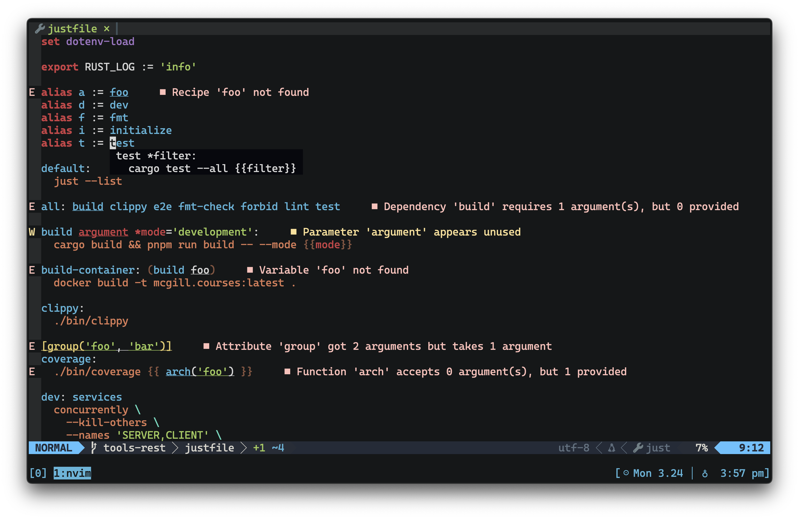

## just-lsp

[](https://github.com/terror/just-lsp/releases/latest)
[](https://crates.io/crates/just-lsp)
[](https://github.com/terror/just-lsp/actions/workflows/ci.yaml)
[](https://codecov.io/gh/terror/just-lsp)
[](https://github.com/terror/just-lsp/releases)
[](https://deps.rs/repo/github/terror/just-lsp)

`just-lsp` is a server implementation of the
[language server protocol](https://microsoft.github.io/language-server-protocol/)
for [just](https://github.com/casey/just), the command runner.

[Website](https://just-lsp.vercel.app/) ·
[Documentation](https://just-lsp.vercel.app/documentation) ·
[Playground](https://just-lsp.vercel.app/playground)



`just-lsp` brings rich editor support to your justfiles, including completions,
hover docs, diagnostics, navigation, renaming, formatting, and running recipes.

## Installation

The easiest way to install it is by using
[cargo](https://doc.rust-lang.org/cargo/index.html), the Rust package manager:

```bash
cargo install just-lsp
```

See the
[installation guide](https://just-lsp.vercel.app/documentation#installation) for
other package managers and pre-built binaries.

## Usage

See the documentation for
[editor setup](https://just-lsp.vercel.app/documentation#usage),
[command-line usage](https://just-lsp.vercel.app/documentation#cli),
[configuration](https://just-lsp.vercel.app/documentation#configuration), and
[features](https://just-lsp.vercel.app/documentation#features).

## Development

See [CONTRIBUTING.md](CONTRIBUTING.md) for build instructions, editor setup for
local development, and parser changes.

## Support

If you need help with `just-lsp`, please feel free to
[open an issue](https://github.com/terror/just-lsp/issues) or ping me on
[Discord](https://discord.gg/ezYScXR). Feature requests and bug reports are
always welcome!
